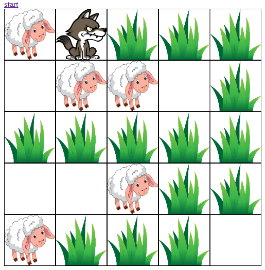

# Wild Llife Simulation Game
I decided to teach my kids how to code javascript. 
The goal of this project is to show basics of variables & functions.

Game generator randomly spawns objects on map.
Sheep eat grass, wolves eat sheeps.

